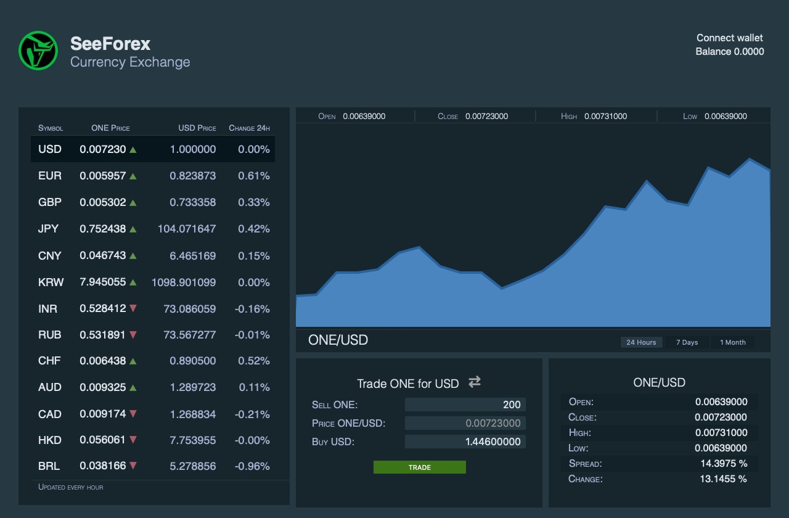

# SeeForex

## Currency Exchange on Harmony Network

SeeForex is a currency exchange for trading fiat tokens at market price. It allows buying and selling currencies with just one click and transaction confirmations occur within seconds thanks to the fastest blockchain protocol Harmony Network.



## How to use it

In order to use SeeForex you need to install Harmony One Wallet extension for Brave, Chrome and Firefox, unfortunately Safari and Edge extensions are not ready yet. So go get the wallet at the Chrome Store and install it in your browser of choice.

Now you can use SeeForex at its fullest and you'll quickly learn how easy it is to interact with the DApp since it has been designed to be a one-click trading experience. Just select the currency you'd like to buy or sell then enter the amount in the form, the price will reflect the current rate at which you'll trade your currency, then click 'TRADE'. Your Harmony Wallet will pop up asking to confirm a transaction and you should click 'Approve' in order to perform a trade. That's it, you will get fiat tokens in your wallet as you can confirm in your new balance.

Once you get your currencies you can send them to any person or business that takes fiat currencies as these tokens are backed by every single ONE traded for them. If you decide to sell your currencies then do the opposite transaction, sell your fiat and get ONE at market price. We collect 1% fee on every transaction for site maintenance and hosting costs.

**That's how easy it is to trade currencies in SeeForex!**

## Fiat Tokens

Fiat synthetic tokens are based on the HRC20 token specification, derived from ERC20 smart contracts they can be easily implemented in Harmony Network and all Ethereum compatible networks.

In order to add fiat tokens to your Harmony wallet, select the Tokens panel and press the (+) button, then enter the token address as specified in this list and the wallet will autommatically fetch the token info. Once you click on the Add button the token will appear on the list and the balance shown.

## SeeForex Video

Watch a video on how to trade currencies on SeeForex


## Contract Addresses

```
USD 0x78690Cf81a96b7f5A26b93F0e8464bBd5a1a3e90 
EUR 0x9cBACEd58014BD857900dfB673f4Bdd988704165 
GBP 0xF42055ac4dc87289Cca73B18441f999a565e8BC8 
JPY 0x6B13609F78c06A39803132a2fb92f57C205fE636 
CNY 0xE17F26fF1A353366623589eE8981A3EA5B074656 
KRW 0xc799f8F4A11806EBEF58bC7f45a062C1663E64B8 
INR 0x88629058205A0070029a6BA1807F1B77F577a050 
RUB 0xc3f065965bd8dD5B158084cFc1c622f1077E05c2 
CHF 0x15975afdd89F41a9F1815B2E0ff2788b0874F512 
AUD 0xa4cc5050DA6b0957e355109201614adc5d687ad0 
CAD 0x9019082CFB94CDf3BF80C591ab2Cc649e41C718c 
HKD 0x0e00c376c7Db89fAD302A4Fa2382750a3aAD3aF8 
BRL 0x13481A6f27BDA9022d9820d4A53122662997A7e6 
```

All contracts are on Mainnet. 

SeeForex charges 1% fee on every transaction for development and hosting costs.

@2021 All rights reserved SeeForex
